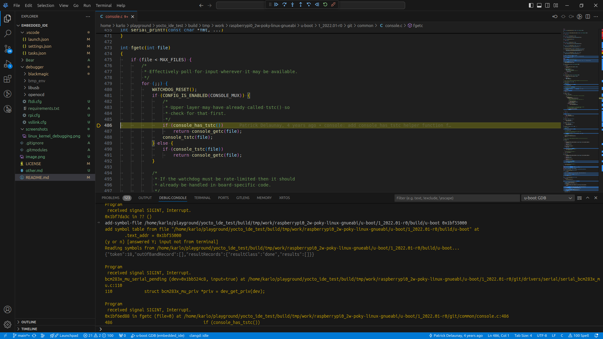

# Embedded/Yocto IDE setup for VSCode/VSCodium


This 100% open source embedded IDE setup supports:
- Yocto projects (Linux kernel, u-boot, arm-trusted-firmware...) full indexation and autocompletion
- Linux kernel full indexation and autocompletion
- JTAG debugging of Linux kernel, u-boot any other Yocto project using JTAG adapters
- Bare metal embedded project full indexation and autocompletion
- SWD/JTAG debugging of bare metal embedded projects using open source JTAG adapter (should be compatible with close source adapters)
- C and C++ applications full indexation and autocompletion
- C and C++ applications full debugging interface

## TL;DR
To reproduce this setup for the **Yocto project**:
1. Install [VSCodium](https://github.com/VSCodium/vscodium)
2. Install the necessary extensions [Extensions chapter](#extensions))
3. Install [Bear](https://github.com/rizsotto/Bear) ```2.4.4``` tool (instructions in [Bear tool chapter](#bear-tool))
4. Install gdb-multiarch
5. Copy ```.vscode``` directory (with ```settings.json```, ```tasks.json``` and ```launch.json```) from this repo to the root directory of your project.
6. Fill out the necessary variables in ```settings.json```
7. Check commands in ```tasks.json```
8. Check ```launch.json```

To build the recipe just: ```Ctrl+Shift+B``` and in popup write recipe name\
To execute any task just:
```
Ctrl+Shift+P
Tasks: Run Task
<select_task_name>
```

## GUI IDE base
The setup is based on [VSCodium](https://github.com/VSCodium/vscodium) that is a fully MIT build of [Visual Studio Code](https://code.visualstudio.com/).\
[VSCodium](https://github.com/VSCodium/vscodium) project also disables telemetry and uses [open-vsx.org](https://open-vsx.org/) as its extension market place.\
[open-vsx.org](https://open-vsx.org/) is an [Eclipse foundation supported project](https://www.globenewswire.com/news-release/2023/06/27/2695137/0/en/The-Open-VSX-Registry-a-Vendor-Neutral-Community-Supported-Alternative-to-the-Visual-Studio-Marketplace-Gets-its-Own-Working-Group-at-the-Eclipse-Foundation.html) and it only hosts open source [Visual Studio Code](https://code.visualstudio.com/) extensions.

## Extensions
To achieve all the desired functionality, these extensions need to be installed and configured:
1. [clangd](https://open-vsx.org/extension/llvm-vs-code-extensions/vscode-clangd)
2. [Native Debug](https://open-vsx.org/extension/webfreak/debug)
3. [Cortex-Debug](https://open-vsx.org/extension/marus25/cortex-debug)
    - (Automatically installed by [Cortex-Debug](https://open-vsx.org/extension/marus25/cortex-debug)) - [debug-tracker-vscode](https://open-vsx.org/extension/mcu-debug/debug-tracker-vscode)
    - (Automatically installed by [Cortex-Debug](https://open-vsx.org/extension/marus25/cortex-debug)) - [MemoryView](https://open-vsx.org/extension/mcu-debug/memory-view)
    - (Automatically installed by [Cortex-Debug](https://open-vsx.org/extension/marus25/cortex-debug)) - [Peripheral Viewer](https://open-vsx.org/extension/mcu-debug/peripheral-viewer)
    - (Automatically installed by [Cortex-Debug](https://open-vsx.org/extension/marus25/cortex-debug)) - [RTOS Views](https://open-vsx.org/extension/mcu-debug/rtos-views)
4. [Open Remote - SSH](https://open-vsx.org/extension/jeanp413/open-remote-ssh)
5. [Python](https://open-vsx.org/extension/ms-python/python) - For crude bitbake highlighting
6. [CMake](https://open-vsx.org/extension/twxs/cmake)
7. [CMake Tools](https://open-vsx.org/extension/ms-vscode/cmake-tools)
8. (Optional) [Code Spell Checker](https://open-vsx.org/extension/streetsidesoftware/code-spell-checker)
9. (Optional) [GitLens](https://open-vsx.org/extension/eamodio/gitlens)
10. (Optional) [Open Remote - WSL](https://open-vsx.org/extension/jeanp413/open-remote-wsl)
11. (Optional) [Hex Editor](https://open-vsx.org/extension/ms-vscode/hexeditor)
12. (Optional) [Doxygen Documentation Generator](https://open-vsx.org/extension/cschlosser/doxdocgen)

## Yocto setup

### Bear tool
In this setup, [clangd](https://open-vsx.org/extension/llvm-vs-code-extensions/vscode-clangd) is used as a replacement for closed sourced [C/C++ Extension](https://marketplace.visualstudio.com/items?itemName=ms-vscode.cpptools).\
That way the whole solution can remain **fully** open sourced.

To make [clangd](https://open-vsx.org/extension/llvm-vs-code-extensions/vscode-clangd) work (index code), [compile_commands.json](https://clang.llvm.org/docs/JSONCompilationDatabase.html) file needs to be generated.\
If your project uses CMake, then this file can be generated by setting ```-DCMAKE_EXPORT_COMPILE_COMMANDS=1```.\
If you are only working on Linux kernel, you can use the [gen_compile_commands.py](https://elixir.bootlin.com/linux/latest/source/scripts/clang-tools/gen_compile_commands.py) (I haven't tried this, I just now it exists).

But to make it generic and to work with any project that can be build by devtool, I decide to use [Bear](https://github.com/rizsotto/Bear).\
With [Bear](https://github.com/rizsotto/Bear) you can pass any build command and it will generate [compile_commands.json](https://clang.llvm.org/docs/JSONCompilationDatabase.html) file that is needed by [clangd](https://open-vsx.org/extension/llvm-vs-code-extensions/vscode-clangd).

#### *Version warning!*
You can probably install [Bear](https://github.com/rizsotto/Bear) with your distros package manager (example: sudo apt install bear), but most likely the package will be version 3.x.x.\
**Version 3.x.x doesn't work with bitbake.**
So to use [Bear](https://github.com/rizsotto/Bear), **an older 2.4.4. version needs to be build.**\
It's really simple and fast to build (no complicated dependencies).\
To build and install [Bear](https://github.com/rizsotto/Bear) 2.4.4.:
```bash
git clone https://github.com/rizsotto/Bear.git
cd Bear/
git checkout 2.4.4
mkdir build
cd build
cmake ..
make all
sudo make install
```

### devtool workspace indexing
After you have fetched all the necessary source codes needed by your Yocto image (using bitbake) and sourced the environment variables, you can open the desired folder in [VSCodium](https://github.com/VSCodium/vscodium).

In the terminal you can run:
```bash
devtool modify <recipe>
cd workspace/sources/<recipe>
bear devtool build <recipe>
```
For example:
```bash
devtool modify virtual/kernel
cd workspace/sources/linux-yocto
bear devtool build linux-yocto
```
or
```bash
devtool modify virtual/bootloader
cd workspace/sources/u-boot
bear devtool build u-boot
```
or
```bash
devtool modify arm-trusted-firmware
cd workspace/sources/arm-trusted-firmware
bear devtool build arm-trusted-firmware
```
This will enable [clangd](https://open-vsx.org/extension/llvm-vs-code-extensions/vscode-clangd) to index the entire source code of your build recipe.

#### VSCodium/VSCode task for devtool workspace indexing
In this repository I have created a task that builds and indexes any Yocto recipe using devtool.\
All you need is to copy ```.vscode``` directory from this repo to your root Yocto project directory and fill out the variables in ```settings.json```.\
The exact build commands are defined in ```tasks.json``` so you can check them if they are valid for your Yocto project setup.\
Using ```Ctrl+Shift+B``` the default build task will run and a popup box will appear that will ask you to write the recipe name that you want to build (using the devtool).\
**I tried to make it all generic, flexible and in one place (```settings.json```) so that it can work with many different project setups.**

### do_compile indexing
If you don't want to use devtool, then you can use the do_compile task:
```bash
bear bitbake -f -c compile <recipe>
```
For example:
```bash
bear bitbake -f -c compile virtual/kernel
```

## C/C++ application setup

### C/C++ application indexing
If you are using this setup for application development, just use CMake as your build system.\
In ```CMakeLists.txt``` file add ```set(CMAKE_EXPORT_COMPILE_COMMANDS ON)```\
This will generate [compile_commands.json](https://clang.llvm.org/docs/JSONCompilationDatabase.html) file and that will be used by [clangd](https://open-vsx.org/extension/llvm-vs-code-extensions/vscode-clangd) extension for project indexing.

### C/C++ application cross compiling using the SDK
In this repo there is a ```.vscode``` directory that has ```settings.json```, ```tasks.json``` and ```launch.json```.\
In ```settings.json``` fill the appropriate variables and to build the application just run **SDK cross compile** task by:\
```Ctrl+Shift+P```\
```Tasks: Run Task```\
```SDK cross compile```

### Remote GDB application debugging on the embedded board
For remote GDB debugging you need to have:
- GDB server on your embedded board (include tools-debug image feature)
- application compiled in debug mode
- gdb-multiarch installed on you computer/laptop

Example of ```launch.json``` that is located in ```.vscode``` directory:
```json
{
    "version": "0.2.0",
    "configurations": [
        {
            "type": "gdb",
            "request": "attach",
            "name": "App remote GDB",
            "gdbpath": "/usr/bin/gdb-multiarch",
            "executable": "${workspaceFolder}/path/to/your/binary",
            "target": "<ip_address>:<port>",
            "cwd": "${workspaceRoot}",
            "remote": true
        }
    ]
}
```
On embedded Linux board run:
```
gdbserver <port> --attach <pid> or gdbserver host:<port> <program>
```
For example:
```
gdbserver :24 /usr/bin/HelloWorld
```
Then in [VSCodium](https://github.com/VSCodium/vscodium) you can just run the application in debug mode with ```F5```.\
You can debug multiple applications at once.

### Development on the remote machine over SSH
With [Open Remote - SSH](https://open-vsx.org/extension/jeanp413/open-remote-ssh) you can have the entire project on a server (build machine) and use the [VSCodium](https://github.com/VSCodium/vscodium) installed on your computer/laptop as if the whole project was located on your computer/laptop.\
This way you can have your server to be Linux and your laptop to be Windows. Everything just works.\
In [Open Remote - SSH](https://open-vsx.org/extension/jeanp413/open-remote-ssh) extension side panel, click on **+** and in the editor fill the information:
```
Host <server_name>
    HostName <ip_address>
    User <user_name>
```
Example:
```
Host bobs_build_machine
    HostName 192.168.100.30
    User bob
```

## Bare metal embedded setup

### Black Magic Probe setup
```bash
# https://cdn.hackaday.io/images/2354611512790941552.89a032cf5a173d298d8d3981a3afcbda
# UART GND -> bluepill G
# UART TXD -> bluepill A10
# UART RXD -> bluepill A9

sudo apt install gcc-arm-none-eabi gdb-multiarch dfu-util

# I have created python virtual environment called bmp_env
# pip install virtualenv
python -m venv bmp_env
source bmp_env/bin/activate
pip install -r requirements.txt
# Or you can do it without python virtual environment and just install stm32loader:
# pip install stm32loader

git submodule update --init --recursive
cd blackmagic/

# List of supported platforms: https://github.com/blackmagic-debug/blackmagic/tree/main/src/platforms
# In my case it's bluepill board -> swlink
make PROBE_HOST=swlink
# If you want code indexing in VSCodium then:
# make clean && bear make PROBE_HOST=swlink

sudo usermod -a -G dialout $USER
# You will have to logout and then log back in before the group change is recognized.
# Immediate and temporary workaround:
# sudo chmod a+rw /dev/ttyUSB0
# or
# sudo chmod a+rw /dev/ttyACM0

# Set BOOT0 pin to 1 (HIGH)

stm32loader --port /dev/ttyUSB0 --family F1 -e -w -v src/blackmagic_dfu.bin

# Set BOOT0 pin to 0 (LOW)

dfu-util -d 1d50:6018,:6017 -s 0x08002000:leave -D src/blackmagic.bin

# https://github.com/siyouluo/STM32-Blue-Pill/blob/master/PDF/The-Generic-STM32F103-Pinout-Diagram.pdf

# https://medium.com/@paramaggarwal/converting-an-stm32f103-board-to-a-black-magic-probe-c013cf2cc38c
# SWD pin map:
# SWDIO -> PB14
# SWCLK -> PA5
# GND

# JTAG pin map:
# TDI -> GPIO B15
# TDO -> GPIO B14
# TCK -> GPIO B13
# TMS -> GPIO B4
# GND

# Manual gdb testing in external terminal:
# gdb-multiarch
# target extended-remote /dev/ttyACM0
# For Serial-Wire Debug Protocol: monitor swdp_scan
# or for JTAG: monitor jtag_scan
# attach 1
```
**Now you can use "BMP attach" launch configuration**

## Linux kernel JTAG debug (FT2232H-56Q Mini Module and Raspberry Pi Zero 2W tested)
### Raspberry Pi setup
```bash
# Setup Raspberry Pi Yocto project:
mkdir yocto
cd yocto
mkdir sources
cd sources

git clone git://git.yoctoproject.org/poky -b kirkstone
git clone git://git.yoctoproject.org/meta-raspberrypi -b kirkstone

source poky/oe-init-build-env

# Add raspberrypi layer to Yocto project
vim conf/bblayers.conf
# Add
${TOPDIR}/../sources/meta-raspberrypi \
# to BBLAYERS

# Configure Raspberry Pi Zero 2W machine
vim conf/local.conf
# Append at the end of the file
MACHINE ?= "raspberrypi0-2w"
# Optionally if you want to use UART console you can add
ENABLE_UART = "1"

# Build the core-image-minimal image
# This is the smallest image but thsi will take a long time
bitbake core-image-minimal

# You can create a defconfig patch in you custom layer to make this permanent, but here we are going to just do it the crude way
# In <path_to_yocto_project>/build/tmp/work/raspberrypi0_2w-poky-linux-gnueabi/linux-raspberrypi/1_5.15.92+gitAUTOINC+509f4b9d68_14b35093ca-r0/linux-raspberrypi0_2w-standard-build
# Add in.config file:
CONFIG_DEBUG_INFO=y

# Then because this is the crude way we are going to force the kernel compilation and sdcard image building
bitbake core-image-minimal -f -c compile linux-raspberrypi
bitbake core-image-minimal

# To link the symbols given by the CONFIG_DEBUG_INFO in vmlinux with the source code, we are going to install the SDK
bitbake core-image-minimal -c populate_sdk
./tmp/deploy/sdk/poky-glibc-x86_64-core-image-minimal-cortexa7t2hf-neon-vfpv4-raspberrypi0-2w-toolchain-4.0.14.sh

# kernel-devsrc recipe doesn't give full source code so we have to do it manually
sudo ln -s <path_to_yocto_project>/build/tmp/work/raspberrypi0_2w-poky-linux-gnueabi/linux-raspberrypi/1_5.15.92+gitAUTOINC+509f4b9d68_14b35093ca-r0/linux-raspberrypi0_2w-standard-build/source /opt/poky/4.0.14/sysroots/cortexa7t2hf-neon-vfpv4-poky-linux-gnueabi/usr/src/kernel

# Write to SD card
sudo apt install bmap-tools
umount /dev/mmcblk0p1
umount /dev/mmcblk0p2
sudo bmaptool copy tmp/deploy/images/raspberrypi0-2w/core-image-minimal-raspberrypi0-2w.wic.bz2 /dev/mmcblk0

# Mount sdcard boot partition to the laptop and add in config.txt
enable_jtag_gpio=1
```

### Setup FT2232H-56Q Mini Module
```bash
# https://ftdichip.com/wp-content/uploads/2024/05/DS_FT2232H.pdf
# https://ftdichip.com/wp-content/uploads/2021/02/DS_FT2232H-56Q_Mini_Module.pdf
# https://pinout.xyz/pinout/jtag

# Pick if you want to use Channel A or B on the FT2232H-56Q Mini Module

# Channel A
# Pin | Pin Name | JTAG | Module Pin Name | Module Connector Name | -> | Pi GPIO | Pi pin
# 12    ADBUS0     TCK    AD0               CN2-8                   ->   GPIO 25   22
# 13    ADBUS1     TDI    AD1               CN2-9                   ->   GPIO 26   37
# 14    ADBUS2     TDO    AD2               CN2-10                  ->   GPIO 24   18
# 15    ADBUS3     TMS    AD3               CN2-11                  ->   GPIO 27   13
# 17    ADBUS4     TRST   AD4               CN2-13                  ->   GPIO 22   15
# 20    ADBUS7     RTCK   AD7               CN2-16                  ->   GPIO 23   16
#                  GND                      CN2-1                   ->   GND       39

# Channel B
# Pin | Pin Name | JTAG | Module Pin Name | Module Connector Name | -> | Pi GPIO | Pi pin
# 32    BDBUS0     TCK    BD0               CN3-25                  ->   GPIO 25   22
# 33    BDBUS1     TDI    BD1               CN3-26                  ->   GPIO 26   37
# 34    BDBUS2     TDO    BD2               CN3-23                  ->   GPIO 24   18
# 35    BDBUS3     TMS    BD3               CN3-24                  ->   GPIO 27   13
# 37    BDBUS4     TRST   BD4               CN3-22                  ->   GPIO 22   15
# 40    BDBUS7     RTCK   BD7               CN3-17                  ->   GPIO 23   16
#                  GND                      CN3-1                   ->   GND       39

# Install FTDI drivers
sudo apt install libudev-dev
# https://stackoverflow.com/questions/4853389/how-to-install-libusb-in-ubuntu
cd debugger
git clone https://github.com/libusb/libusb.git # or in this repo you can just run git submodule update --init --recursive
git checkout v1.0.27
./autogen.sh
sudo make install

# Install openocd
# https://docs.espressif.com/projects/esp-idf/en/stable/esp32/api-guides/jtag-debugging/building-openocd-linux.html
sudo apt-get install libtool
git clone https://github.com/openocd-org/openocd.git # or in this repo you can just run git submodule update --init --recursive
./bootstrap
./configure --enable-ftdi --enable-stlink --enable-vsllink
make
sudo make install

# When you connect the FTDI adapeter, check that VID and PID are the same with ftdi.cfg
lsusb

# Start the openocd
sudo /usr/local/bin/openocd -f ftdi.cfg -f rpi.cfg

# Check the SDK_ENV path in settings.json because the "SDK source" task will be run before starting the debug session
# Launch Linux kernel GDB from launch.json
```
**Now you can debug linux kernel:**\


## U-Boot JTAG debug (FT2232H-56Q Mini Module and Raspberry Pi Zero 2W tested)
Yocto project and FT2232H-56Q Mini Module setup is in described in Linux kernel JTAG debug (FT2232H-56Q Mini Module and Raspberry Pi Zero 2W tested) chapter.
```bash
# Add u-boot to local.conf
vim conf/local.conf
# Append at the end of the file
RPI_USE_U_BOOT = "1"

# Build the image with u-boot
bitbake core-image-minimal

# Write to SD card
umount /dev/mmcblk0p1
umount /dev/mmcblk0p2
sudo bmaptool copy tmp/deploy/images/raspberrypi0-2w/core-image-minimal-raspberrypi0-2w.wic.bz2 /dev/mmcblk0

# Enter u-boot console on embedded device and run bdinfo command to get the realocation address
U-Boot> bdinfo
#[...]
relocaddr   = 0x1bf55000
#[...]

# Fill the paths in launch.json for "u-boot GDB"
# When the debugger is attached, press pause
# GDB will have a problem finding debug symbols
# This is because on embedded device the u-boot is offseted in addres
# So we need to offset the debug symbols as well
# Open DEBUG CONSOLE In vscode and enter the add-symbol-file command
# add-symbol-file <path_to_u-boot> <relocaddr>
# For example:
add-symbol-file /home/karlo/playground/yocto_ide_test/build/tmp/work/raspberrypi0_2w-poky-linux-gnueabi/u-boot/1_2022.01-r0/build/u-boot 0x1bf55000
```
**Now you can debug u-boot:**\


## Why I insist on VSCodium instead of Visual Studio Code?
I wanted to have a **100%** open source solution.\
Inside Yocto we have such complex tools that are fully open sourced like Linux kernel, GCC, GLIBC, openSSL, u-boot, bitbake, QUEMU...\
I guess for me, its kind of silly to have all this complex software and then have some editor or C/C++ extension or debugger frontend GUI close sourced.

**With that said, I wan't to emphase how much of a big fan I am of all the work that Microsoft did with Visual Studio Code.**\
Making it open source under MIT license with [Code - OSS](https://github.com/microsoft/vscode) project is just amazing!

My plan is to have full compatibility with [Visual Studio Code](https://code.visualstudio.com/).\
If you don't want [VSCodium](https://github.com/VSCodium/vscodium) or simply don't care, you can use everything in [Visual Studio Code](https://code.visualstudio.com/).

## Collection of useful tips

### clangd extension function arguments insertion
Inside the editor, clangd extension inserts the function arguments in the function calls.\
This feature is called **inlay hints** and can be turned on or off with ```editor.inlayHints.enabled``` field in the settings.

### Enable Command Center in VSCodium in Linux distro
Open Settings and type in search **Window: Command Center**\
Set Window: Command Center to **ON**.\
Then type in search **Window: Title Bar Style**\
Set Window: Title Bar Style to **custom**

### Install VSCodium in WSL2
**This was before the [Open Remote - WSL](https://open-vsx.org/extension/jeanp413/open-remote-wsl) extension.**

In the WSL2 distro, you can setup the specific package manager. Instructions are in https://vscodium.com/

or

Manual download from the [release package](https://github.com/VSCodium/vscodium/releases) (for example codium_1.84.2.23319_amd64.deb) and then use
```bash
sudo apt install ~/Downloads/<package_name>.deb
```
In this case you don't have **Check for updates...** option inside the [VSCodium](https://github.com/VSCodium/vscodium).\
To fix this:
```bash
cd ~/.config/VSCodium
touch product.json
vim product.json
```
```json
{
    "updateUrl": "https://vscodium.now.sh",
    "downloadUrl": "https://github.com/VSCodium/vscodium/releases"
}
```

### WSL2 VSCodium Windows shortcut
**This was before the [Open Remote - WSL](https://open-vsx.org/extension/jeanp413/open-remote-wsl) extension.**

Create a new Windows Shortcut (right click on Desktop -> New -> Shortcut):\
Type the location of the item:
```
C:\Windows\System32\wsl.exe bash -c "export GDK_SCALE=1 && export XCURSOR_SIZE=24 && DONT_PROMPT_WSL_INSTALL=1 codium"
```
**Next**

Type a name for this shortcut:
```
codium_wsl.exe
```
**Finish**

Command attributes explanation:
- GDK_SCALE is if you use scaling on your monitor. In this example, the scale is set to 1 (100%).
- XCURSOR_SIZE is the size of the mouse cursor in gWSL. The default cursor was enormous for me. Value examples: 16, 24, 32, 48, 64.
- DONT_PROMPT_WSL_INSTALL - this is to remove the warning message that you should install VSCode in Windows and then use proprietary Microsoft WSL extension.

## TODO
- Create a version compatibility issue in the [Bear](https://github.com/rizsotto/Bear) repository
- <s>Incorporate the official [vscode-bitbake](https://github.com/yoctoproject/vscode-bitbake) extension</s> (This is not possible since this extension builds on top of Microsoft's proprietary cpptools. However I wanted to leave it here because this is the **official** Yocto extension and if you don't care about pure open source solution then try it out)
- Make [Versaloon JTAG adapter](https://github.com/zoobab/versaloon) setup work